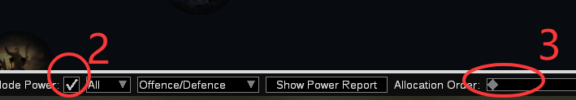
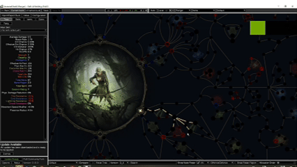

# Path of Building Talent Order Planning Tool
## Background
In *Path of Exile*, the allocation of talent points is crucial to character strength, especially during the campaign phase. A well-planned order of talent allocation can often determine whether you succeed in defeating a boss. However, the cost of respeccing early on is high, and players are required to make precise plans among numerous talent branches.
Currently, many players use **Path of Building (POB)** to simulate talent builds. To refine their planning, they often create separate talent pages for each act. Yet even with this level of detail, a single talent page may contain multiple branches, making it difficult to decide the optimal order of allocation.
To address this issue, I have added a **slider control** to POB, allowing players to easily determine the best order for allocating each talent point.
## Features
- A new slider control added to the POB interface
- By adjusting the slider, players can view the recommended allocation order for each talent point
- Helps players achieve an "optimal path" at every step, especially when resources are limited in the early game
## Usage Guide
1. Open the main POB interface and click the **"New Path build"** button

2. On the talent page, check the **"Show Node Power:"** 

3. The slider control will appear, allowing you to plan your allocation order accordingly

## Source Reference
This project is an extension based on the following repository:  
[https://github.com/PathOfBuildingCommunity/PathOfBuilding-PoE2.git](https://github.com/PathOfBuildingCommunity/PathOfBuilding-PoE2.git)